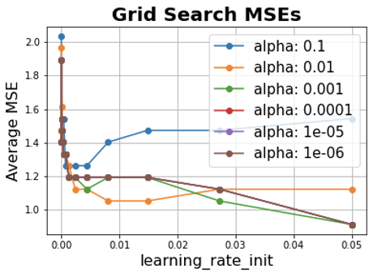
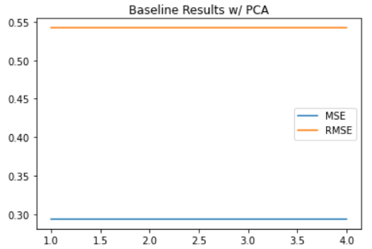

## CS 4641 - Predictive Stock Machine Learning Final Report
#### Fletcher Wells, Javier Arevalo, Matthew Nilsen, Cedric de Pierrefeu, Shengyuan Huang 

# Abstract:

Stock prediction has been attempted before using a wide range of different methods. Our goal for this project will be to use a broad range of financial analysis indicators to predict stock growth at different points in time. We will do so by using a polynomial regression model to analyse stock analysis indicators as well as data retrieved from financial statements.

# Introduction/Background: 

Since the late 1980s various world renowned researchers, institutions, hedge funds, and banks have investigated the task of how to use data mining and machine learning to increase profitability in the stock market. This is one of the most research ML areas and various newer research papers have considered novel input to the predictive models such as a company’s relevant tweets (NLP), technical indicators, environmental indicators, among many others. 

The reason why this problem is so important and crucial is because of the numbers game. Even if a model beats the market by a small percentage, given a sufficiently large amount of money this model(s) can become extremely profitable for business (IB, HedgeFunds, etc.). Many of the work that has been done previously is not publicly available, because of the highly profitable nature of such models and algorithms. The research papers that are available (mostly on Sentiment Analysis on the stock market).

# Problem definition:

We want to use different technical and fundamental stock metrics to create a regression model to try and estimate the growth of a stock one year from the date we look at the fundamentals. Typically, people only use technical indicators in their models or they perform a classification to determine which stocks will meet a growth threshold and which won’t.1 However, we feel that using financial ratios like RoE, RoIC, etc. combined with financial metrics like growth in book value, growth in earnings, etc. can add to the model’s ability to estimate growth. This is because these numbers are found in a company’s financial statements and have a substantive meaning to the company’s performance. We expect that we will be able to estimate at least whether a company will grow or shrink in value. This will be done by employing several predictive algorithms that use either polynomial regression or neural network regression. We also will create a classification model to predict whether a company's growth will be less than or greater than a baseline. In order to collect data for these models, we will collect temporal financial data from an API in order to feed our algorithm.

For the polynomial regression model, we assume that there exists a linear or polynomial relationship between the features. In case there is any collinearity between the features, we will be performing PCA on the data.

# Data Collection:

We collected all of our data from the FinancialModelingPrep API and used the following endpoints:

*   api/v3/enterprise-values/
*   api/v3/income-statement-growth/
*   api/v3/ratios/

<table>
  <tr>
   <td>
<strong>Name</strong>
   </td>
   <td><strong>Formula</strong>
   </td>
   <td><strong>Description</strong>
   </td>
  </tr>
  <tr>
   <td>Current Ratio
   </td>
   <td>Current assets / current liabilities
   </td>
   <td>Measures ability to pay short term obligations
   </td>
  </tr>
  <tr>
   <td>Quick Ratio
   </td>
   <td>(Current assets - inventory) / current liabilities
   </td>
   <td>Measures short-term liquidity
   </td>
  </tr>
  <tr>
   <td>Gross Profit Margin
   </td>
   <td>(Revenue - Cost of Goods Sold) / Revenue
   </td>
   <td>Shows how successful a company is in producing profit above costs
   </td>
  </tr>
  <tr>
   <td>Operating Profit Margin
   </td>
   <td>Operating Income / Revenue
   </td>
   <td>Shows how efficiently a company is able to generate profit
   </td>
  </tr>
  <tr>
   <td>Return on Assets
   </td>
   <td>Net Income / Total Assets
   </td>
   <td>Shows how profitable a company is relative to its assets
   </td>
  </tr>
  <tr>
   <td>Return on Equity
   </td>
   <td>Net Income / Shareholder Equity
   </td>
   <td>Measures business profitability in relation to shareholder equity
   </td>
  </tr>
  <tr>
   <td>Return on Capital Employed
   </td>
   <td>Earnings Before Interest and Tax / Capital Employed
   </td>
   <td>Shows how efficiently a company is able to generate profits from its capital
   </td>
  </tr>
  <tr>
   <td>Debt Equity Ratio
   </td>
   <td>Liabilities / Shareholder Equity
   </td>
   <td>Shows how leveraged a company is
   </td>
  </tr>
  <tr>
   <td>Price Book Ratio
   </td>
   <td>Share Price / (Book Value / Share)
   </td>
   <td>Shows a company’s stock valuation in relation to the company’s book value
   </td>
  </tr>
  <tr>
   <td>Price Sales Ratio
   </td>
   <td>Market Cap / Total Sales
   </td>
   <td>Measures how much investors are paying per dollar of company sales
   </td>
  </tr>
  <tr>
   <td>Price Earnings Ratio
   </td>
   <td>Share Price / (Earnings / Share)
   </td>
   <td>Shows how high a company is values in relation to its actual earnings
   </td>
  </tr>
  <tr>
   <td>Price to Earnings Growth Ratio
   </td>
   <td>(Price / Earnings) / Expected EPS Growth
   </td>
   <td>Shows how much investors are paying for earnings in relation to expected earnings growth
   </td>
  </tr>
  <tr>
   <td>Price to Operating Cash Flow Ratio
   </td>
   <td>Share Price / (Operating Cash Flow / Share)
   </td>
   <td>Shows how much investors are paying for cash coming into a business before deductions
   </td>
  </tr>
</table>

We also used the following values:

*   Revenue Growth
*   Cost of Revenue Growth
*   Gross Profit Growth
*   Gross Profit Ratio Growth
*   Operating Expense Growth
*   Earnings Before Interest, Taxes, Depreciation, and Amortization Growth
*   Operating Income Growth
*   Net Income Growth
*   Earnings Per Share Growth
*   Market Capitalization
*   Enterprise Value

# Methods:

Our first step was to model the predictive algorithm as a regression problem. Since regression assumes independent input, we scaled our data using standard scaling and then performed PCA, selecting our principal components using MLE.

To collect our sample data, we used the API to grab a random sample of stock tickers that we knew had data, collected the quarterly financial data for each stock, and then chose a number of random samples from each company’s financial data. To get our Y labels, we took the date and ticker for each of our samples, added 1 year to the date, and, if there was a price for the future date, calculated the total increase in stock price as a percentage from the original date.

Before manipulating the data, we graphed the distributions of each feature. Below are a few of the most and least correlated feature distributions.

After this, we standardized the data and performed PCA using MLE to reduce the number of features. We then generated polynomial features of degrees 1-5 to test which one would result in the least amount of error after testing. Finally, we split each set of features into training and test sets, trained the linear regressor, and plotted the resulting errors.

Next, we trained two neural net models: one was a regression neural net that predicted a continuous value, the other was a classification neural net that predicted a discrete class. In this case, there were two classes {-1, 1}, where -1 indicated growth that was below the baseline of 6% growth in stock price, and 1 indicated growth that was greater than or equal to the baseline. For both neural net models, we performed a grid search to find the hyperparameter values that yielded the best results. Below are two graphs representing the grid search results of the neural net classification model with and without PCA respectively. The alpha is the regularization constant, and the other learning_rate_init is the initial learning rate of the model.

After noticing that we had some predictions that were very far from realistic values, we decided to try to remove outliers from our training data and limit the scope of the predictions our model could make. Since companies can’t lose more than 100% of their value in a year, we changed all predictions less than -100% to -100% (-1). The person tasked with removing outliers didn’t have their work done in time, but we predict that it would have helped reduce our error even more.

After completing all of the above steps, we ran several trials while varying the sets of random tickers and samples. We used this data to compare the performance of each model.

<table>
  <tr>
   <td>
   </td>
   <td colspan="2" >Baseline MSE
   </td>
   <td colspan="2" >Linear Regression MSE
   </td>
   <td colspan="2" >Polynomial Regression (Degree 3) MSE
   </td>
   <td colspan="2" >Neural Net Regression MSE
   </td>
   <td colspan="2" >Baseline Classification MSE
   </td>
   <td colspan="2" >Neural Net Classification MSE
   </td>
  </tr>
  <tr>
   <td>Trial #
   </td>
   <td>No PCA
   </td>
   <td>PCA
   </td>
   <td>No PCA
   </td>
   <td>PCA
   </td>
   <td>No PCA
   </td>
   <td>PCA
   </td>
   <td>No PCA
   </td>
   <td>PCA
   </td>
   <td>No PCA
   </td>
   <td>PCA
   </td>
   <td>No PCA
   </td>
   <td>PCA
   </td>
  </tr>
  <tr>
   <td>

1

   </td>
   <td>

0.48

   </td>
   <td>

0.48

   </td>
   <td>

0.29

   </td>
   <td>

0.30

   </td>
   <td>

8.78E+04

   </td>
   <td>

2.24E+04

   </td>
   <td>

3.89E+14

   </td>
   <td>

0.39

   </td>
   <td>

1.68

   </td>
   <td>

1.68

   </td>
   <td>

1.73

   </td>
   <td>

1.82

   </td>
  </tr>
  <tr>
   <td>

2

   </td>
   <td>

0.56

   </td>
   <td>

0.56

   </td>
   <td>

7.34

   </td>
   <td>

7.36

   </td>
   <td>

3.14E+07

   </td>
   <td>

4.12E+07

   </td>
   <td>

3.11E+12

   </td>
   <td>

1.07

   </td>
   <td>

1.83

   </td>
   <td>

1.83

   </td>
   <td>

1.85

   </td>
   <td>

1.55

   </td>
  </tr>
  <tr>
   <td>

3

   </td>
   <td>

0.38

   </td>
   <td>

0.38

   </td>
   <td>

24.50

   </td>
   <td>

20.45

   </td>
   <td>

2.08E+09

   </td>
   <td>

1.24E+10

   </td>
   <td>

1.94E+14

   </td>
   <td>

0.81

   </td>
   <td>

1.99

   </td>
   <td>

1.99

   </td>
   <td>

2.17

   </td>
   <td>

2.04

   </td>
  </tr>
  <tr>
   <td>

4

   </td>
   <td>

0.29

   </td>
   <td>

0.29

   </td>
   <td>

1.02

   </td>
   <td>

0.69

   </td>
   <td>

3.75E+06

   </td>
   <td>

2.32E+07

   </td>
   <td>

7.29E+13

   </td>
   <td>

0.63

   </td>
   <td>

2.09

   </td>
   <td>

2.09

   </td>
   <td>

2.26

   </td>
   <td>

1.83

   </td>
  </tr>
  <tr>
   <td>

5

   </td>
   <td>

0.38

   </td>
   <td>

0.38

   </td>
   <td>

0.29

   </td>
   <td>

0.29

   </td>
   <td>

2.11E+14

   </td>
   <td>

2.11E+14

   </td>
   <td>

2.87E+02

   </td>
   <td>

0.29

   </td>
   <td>

2.18

   </td>
   <td>

2.18

   </td>
   <td>

1.75

   </td>
   <td>

1.69

   </td>
  </tr>
  <tr>
   <td>

6

   </td>
   <td>

0.94

   </td>
   <td>

0.94

   </td>
   <td>

5.15

   </td>
   <td>

2.83

   </td>
   <td>

5.06E+04

   </td>
   <td>

8.17E+05

   </td>
   <td>

2.27E+15

   </td>
   <td>

0.63

   </td>
   <td>

1.92

   </td>
   <td>

1.92

   </td>
   <td>

2.13

   </td>
   <td>

1.76

   </td>
  </tr>
  <tr>
   <td>Total
   </td>
   <td>

3.04

   </td>
   <td>

3.04

   </td>
   <td>

38.59

   </td>
   <td>

31.92

   </td>
   <td>

2.11E+14

   </td>
   <td>

2.11E+14

   </td>
   <td>

2.93E+15

   </td>
   <td>

3.83

   </td>
   <td>

11.69

   </td>
   <td>

11.69

   </td>
   <td>

11.88

   </td>
   <td>

10.68

   </td>
  </tr>
  <tr>
   <td>Average
   </td>
   <td>

0.51

   </td>
   <td>

0.51

   </td>
   <td>

6.43

   </td>
   <td>

5.32

   </td>
   <td>

3.52E+13

   </td>
   <td>

3.52E+13

   </td>
   <td>

4.88E+14

   </td>
   <td>

0.64

   </td>
   <td>

1.95

   </td>
   <td>

1.95

   </td>
   <td>

1.98

   </td>
   <td>

1.78

   </td>
  </tr>
</table>

<table>
  <tr>
   <td>Trial #
   </td>
   <td>Tickers Trained On
   </td>
   <td># of Data Points
   </td>
   <td># of Tickers
   </td>
  </tr>
  <tr>
   <td>

1

   </td>
   <td>['INDORAMA.NS', 'BOSN.SW', 'ALEMBICLTD.NS', 'PFLT', 'BOBNN.SW', 'KFRC', 'MTSL', 'OCSL', '2348.HK', 'UNS.TO', 'SLNG', 'HOG', 'DD', 'BTBB.DE', 'ALLSEC.NS', 'SW1.DE', 'FHZN.SW', 'QURE', '6830.HK', 'VRNS', 'CIGI', 'CTHR', 'NRZ', 'PEBK', 'PAA', 'CWX.TO', 'XFOR', 'IXI.L', '2777.HK', 'RAMCOSYS.NS', 'ARR', 'FLO.L', 'ABAN.NS', 'LMNR']
   </td>
   <td>

400

   </td>
   <td>

34

   </td>
  </tr>
  <tr>
   <td>

2

   </td>
   <td>['VNDA', 'JRSH', 'UVE', 'BRY.TO', '1681.HK', 'LVCG.L', 'ERF.TO', 'AKTS', 'SLM', 'HBB', 'BNGO', 'BX', 'PXS', 'GEOS', 'CLW', 'DNT.TO', 'XOG', 'PHSC.L', 'PLAG', 'EPD', 'NXGN', 'NTUS', 'CPF', 'AMNL', 'SUPPETRO.NS', 'Z', 'PFB.TO']
   </td>
   <td>

398

   </td>
   <td>

27

   </td>
  </tr>
  <tr>
   <td>

3

   </td>
   <td>['3331.HK', 'WIG1.DE', '1150.HK', 'SEB', 'GPC', 'CAI', 'CEATLTD.NS', 'TIMETECHNO.NS', 'PCA.L', 'HEP', 'HMC', 'LUPIN.NS', '1396.HK', 'FIRE.TO', 'TAP', 'ALGN', 'SGMO', 'IVC', 'DHR', 'DEC.PA', 'ALCOR.PA', 'EQR', 'PAR', 'INLB', 'AOS', 'NUVA', 'LECN.SW', 'ALNEV.PA', 'PRG', 'SE', 'NRT', 'GSC1.DE', 'ED4.DE', 'NOG.L', 'IBAB.BR', 'KALA', 'WLFC', 'TERB.BR', '1326.HK', 'VAKRANGEE.NS']
   </td>
   <td>

461

   </td>
   <td>

40

   </td>
  </tr>
  <tr>
   <td>

4

   </td>
   <td>['NIPPOBATRY.NS', 'CLSH', 'EIF.TO', 'CDXI', 'BKE', 'CNK', 'XERS', 'PET.L', 'LADR', 'GGD.TO', 'CEM', 'AIZ', 'MHLD', 'AYX', 'NBRV', '2328.HK', 'RSL2.DE', 'HLIO', 'LAND', 'NET.L', 'AER', 'DDD', 'O2C.DE', 'TRCH', 'MXIM', 'SP']
   </td>
   <td>

283

   </td>
   <td>

26

   </td>
  </tr>
  <tr>
   <td>

5

   </td>
   <td>['PLYA', '1132.HK', '2309.HK', '2HP.DE', 'GBGLOBAL.NS', 'KTOS', 'MMD', 'ITP.TO', 'DRNA', 'SUI', 'FSZ.TO', 'KFY', 'BRKN.SW', 'PLYM', 'ZEN', 'STRA', 'EBS', 'PBIO', 'SMCI', 'BKD', 'IPSI', 'NMM.DE', 'POOL', 'TNDM', 'LADR', 'TKAT', 'DIGJAMLTD.NS', 'PPC.L', 'SESG.PA', 'PRTC.L']
   </td>
   <td>

385

   </td>
   <td>

30

   </td>
  </tr>
  <tr>
   <td>

6

   </td>
   <td>['WARN.SW', 'AB.PA', '8082.HK', 'PHP.L', 'OBAS', 'FRETAIL.NS', 'ARMP', 'OMI', 'TGO.TO', 'FANH', 'ECLERX.NS', 'DSL', 'KARURVYSYA.NS', 'ASND', 'AKE.PA', 'SMBK', 'BHAGERIA.NS', 'COVH.PA', 'HMST', 'SIYSIL.NS', 'ZICOM.NS', 'MBIO', 'CZR', 'CCA.TO', 'UCTT', '8100.HK', '2028.HK', 'TCF', '8006.HK', '1241.HK', 'MGPI', '6090.HK', 'VMO']
   </td>
   <td>

329

   </td>
   <td>

33

   </td>
  </tr>
</table>

# Metrics:

    As a baseline, we estimated the growth percentage of all companies using the average gain of the S&P 500,  which is around 6%. We took a similar approach for the classification baseline, where we estimated the growth of all companies to be greater than or equal to 6%. Then, as we added complexity to our model, we checked to see how our MSE and RMSE reacted.

# Results:

We found that our model very quickly became overfitted when using polynomial regression. For example, here are the error charts for our model with and without PCA along with the error chart for our baseline. Note: the y-axis is the error and the x-axis is the degree of the polynomial used to transform the features.

While you can see that PCA drastically improved our model error, it is still much higher than the baseline which had an average MSE of 0.51, with a range of 0.65 and varied depending on the stocks/samples selected. To gain more insight into how our predicted values compare to the true values, we calculated the mean, standard deviation, minimum, and maximum of a set of predicted values. By doing this, we saw that the mean for the predictions was -49% and the standard deviation was 198%. This was mainly because we had an extremely low minimum of -1175%. Taking a step back, we realized that this isn’t even possible because the max any number can decrease is -100%. As a result, we decided to limit the predictions of our model.

We replaced all predictions less than -1 (-100%) with -1 since a company cannot decrease more than 100% in price. By increasing the minimum to -1, the mean for the aforementioned predictions went up to 13% and the standard deviation went to 43%. This usually had a significant effect on our results as well. For example in the graphs below, the model MSE with PCA and without a limited minimum for a 1st degree polynomial was 56.2, while the MSE with PCA and with a limited minimum for a 1st degree polynomial was 0.89. 

To further analyze why the model error was still significantly higher than the expected, we decided to remove outliers from the data to see if this helped reduce our error. To remove the outliers, we first calculated the z-score of all the features, and defined a threshold for which to classify a data point as an outlier. The z-score used was of value 3.0. The below results show the effect of removing outliers on a sample set of blue chip stocks for which we had all the feature training data available: 

Model results with outliers:

Model results without outliers:

After removing the outliers, the model performed significantly better as evident above. We concluded that the outliers on our training data played a significant role in the overfitting of our model, and in the accuracy decrease previously observed. After removing the outliers, the MSE and RSME values were below 1 and within the range of our baseline model.  This clearly indicates that the reason why our previous results were not as expected was not because our model was incorrectly set up but rather because our data contained a large number of outliers that had a great impact on our linear regression model. 

 For the neural net regression (NNR) model, we found the model to often yield better results than the polynomial regression models. From the 6 trials recorded with PCA, we found the NNR model to have beat the baseline 3 out of 6 times, whereas the linear model beat the baseline 2 out of 6 times. Additionally, the MSE of the linear model was only below the MSE of the NNR model once. The 3rd degree polynomial model always had a much higher MSE than the 1st degree linear regression model. The average MSEs for the baseline and the linear, 3rd degree polynomial, and neural net regression models were 0.51, 5.32, 3.52*10^13, and 0.63 respectively. Thus, the highest performing regression model we created was the neural net regression model.

The neural net classification model was able to beat the baseline slightly more than 50% of the time. It beat the classification baseline in 4 out of 6 of the trials.

# Discussion:

Our goal for this project was to find a model that could use a snapshot of a company’s current financial situation to predict how much that company would grow in the next year. Going into this problem, we had our doubts about how well our solution would end up working because if you could accurately predict how much a company’s stock price was going to grow in the next year, you could begin ordering stocks by which ones you thought would have the highest return to choose which ones to invest in. Using AI/ML to pick stocks is something that tons of major corporations and hedge funds are working on and have been working on for a while, and even so it is generally accepted that it is impossible to “beat the market.” Nonetheless, we wanted to take a shot and see how close we could come to “beating the market,” which has an average return of around 6% per year.

One of the first things we noticed was that our first model’s MSE was massive compared to our baseline. From here, we attempted a variety of different methods to give our model the best results possible while being aware that, potentially, there is little to no correlation between a company’s current financials and their future growth. A common reason for this is that if the information is already public, it is “priced in” to the current value of the stock.

In the end, we were happy with our results since we consistently got much closer to the baseline than we started. We also ended up beating the baseline a few times, albeit not consistently enough to count as proven results. One thing that could have potentially affected our results is our inability to collect enough data. Although we upgraded from the free version of the API in order to get access to higher API call rates and a larger history of data, we were still limited to 300 calls per minute. We currently make one call to get a list of tickers, three calls per ticker to get financial information from different endpoints, and one more call per ticker to get historical price information. With higher limits we could have collected more data to train our models with.

If we had more time to experiment with different models, I would want to try to collect more data from different sources. If our data wasn’t limited to financial data and also included more holistic information like sentiment analysis of tweets containing the specific stock tickers, sentiment analysis on relevant financial news articles, and global economy factors like interest rates we could potentially get closer to beating the baseline because all of these things influence or are indicative of stock price movements. I would also be interested to see how our results varied by using ICA instead of PCA as well as trying out decision tree regression.

# Ethics Statement:

If not used well, machine learning can have dire consequences when used in stock market trading. In our case, we hope to use our algorithms to bring more money to the common people by making such knowledge more widely available to the public. However, this work can be used by the wealthy, who have more resources to allocate towards developing effective ML models for predicting the stock market. This gives the wealthy an unfair advantage and may further increase the wealth gap in the United States. One way to change the model in order to help this problem is to use decision trees instead in order to make the model more understandable to the public.

If models such as the one we aimed to design were used in autonomous trading agents at large scale, they could potentially influence the market and manipulate it in a way that is extremely difficult to track down. University of Michigan Professor Michael P. Wellman describes that "trading agents can respond to information much faster than human reaction time," which makes it challenging to understand how they will perform in unanticipated circumstances".3 Because of this, these algorithms may unintentionally manipulate the market, and their speed causes them to be hard to track down and be held accountable.

Additionally, our model may tell us to invest in a company that perpetuates unethical actions. To mitigate this, we must always research the company before we invest in it. Additionally, we should avoid training on unethical companies, in order to avoid such problems in the first place. Future work could include creating an ML algorithm to determine if a company is ethical.

# Bibliography: 

1. Milosevic, N. (2016). Equity forecast: Predicting long term stock price movement using machine learning. _arXiv preprint arXiv:1603.00751_.
2. Cao, Lijuan & Tay, Francis. (2001). Financial Forecasting Using Support Vector Machines. Neural Computing and Applications. 10. 184-192. 10.1007/s005210170010.
3. Nunno, L. (2014). Stock Market Price Prediction Using Linear and Polynomial Regression Models.
4. Wellman, M.P., Rajan, U. Ethical Issues for Autonomous Trading Agents. _Minds & Machines_ **27, **609–624 (2017).[ https://doi.org/10.1007/s11023-017-9419-4](https://doi.org/10.1007/s11023-017-9419-4)
